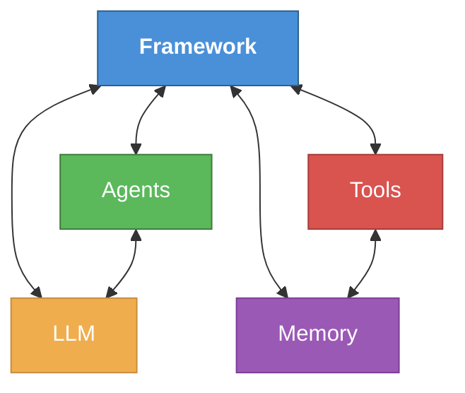
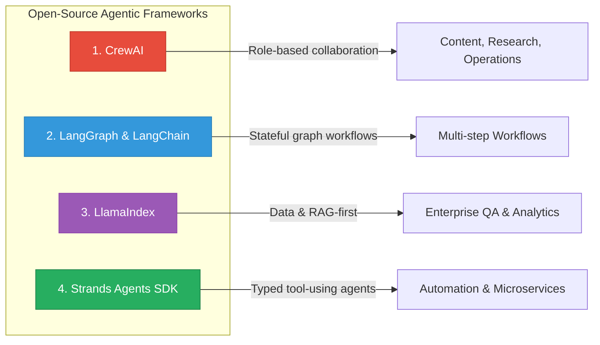
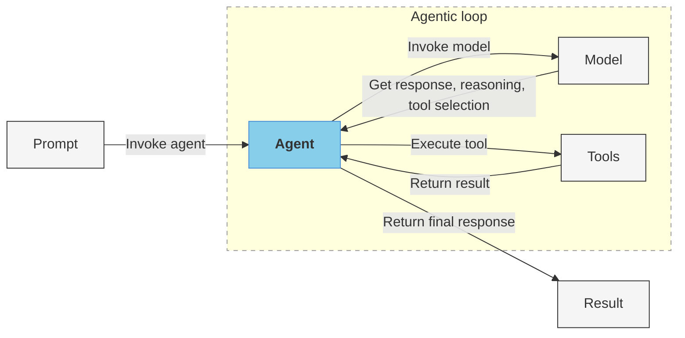
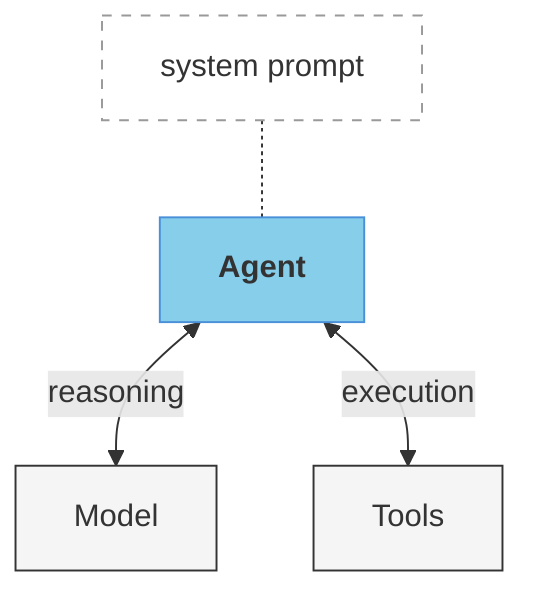
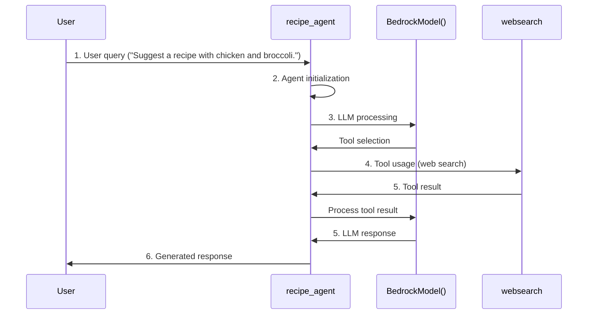

# Cours - IA Agentique et AWS AgentCore

## Introduction aux Frameworks Agentiques

Agentic frameworks transform Large Language Models, or LLMs, from simple question-answering systems into goal-oriented agents that can execute complex tasks. These frameworks provide key capabilities for autonomous work and problem-solving.

---

## Agentic AI Framework Capabilities

### Architecture Overview



### Key Capabilities

| Capability | Description |
|---|---|
| **Agent Orchestration** | Coordinates information flow and decision-making across single or multiple agents to achieve complex goals without human intervention. |
| **Model and Tool Integration** | Helps agents interact with LLMs for reasoning. Connects agents to external systems, APIs, and data sources to enrich context with knowledge. |
| **Memory Management** | Provides persistent or session-based state to maintain context across interactions. Important for long-running autonomous tasks. |
| **Workflow Definition** | Supports structured patterns like chains, routing, parallelization, and reflection loops that enable autonomous reasoning. |
| **Deployment and Monitoring** | Facilitates the transition from development to production with observability for autonomous systems. Helps agents operate reliably at scale. |

---

## Detailed Capabilities

### 1. Agent Orchestration

Agent orchestration coordinates information flow and decision-making across single or multiple agents to achieve complex goals without human intervention.

### 2. Model and Tool Integration

Model and tool integration helps agents interact with LLMs for reasoning. This integration also connects agents to external systems, APIs, and data sources to enrich context with knowledge.

### 3. Memory Management

Memory management provides persistent or session-based state to maintain context across interactions. This capability is important for long-running autonomous tasks.

### 4. Workflow Definition

Workflow definition supports structured patterns like chains, routing, parallelization, and reflection loops that enable autonomous reasoning.

### 5. Deployment and Monitoring

Deployment and monitoring facilitate the transition from development to production with observability for autonomous systems. This helps your agents operate reliably at scale.

---

## Open-Source Frameworks

There are open-source frameworks for building AI agents. They provide building blocks for tool use, memory, routing, collaboration, and production ops.



### 1. CrewAI

> **Use case:** Coordinated content, research, and operations.

CrewAI enables role-based agent collaboration. It orchestrates specialist teams with task decomposition, handoffs, review and feedback, and optional human-in-the-loop (HITL) support. Good for coordinated content, research, and operations.

**Key features:**
- Role-based agent collaboration
- Task decomposition and handoffs
- Review and feedback loops
- Optional human-in-the-loop (HITL) support

---

### 2. LangGraph and LangChain

> **Use case:** Multi-step workflows needing tracing and persistence.

LangGraph and LangChain support complex, stateful agent apps. LangGraph models control flow as a graph (branching, loops, checkpoints). LangChain provides tool calling and memory plus a large ecosystem. Use for multi-step workflows needing tracing and persistence.

**Key features:**
- Control flow modeled as a graph
- Branching, loops, and checkpoints
- Tool calling and memory
- Large ecosystem with tracing support

---

### 3. LlamaIndex

> **Use case:** Enterprise QA and analytics across many data systems.

LlamaIndex is data and Retrieval Augmented Generation (RAG)-first. It offers indexes, retrievers, and routers so agents can query heterogeneous sources (docs, SQL, APIs) and synthesize answers. Choose for enterprise QA and analytics across many data systems.

**Key features:**
- Data and RAG-first approach
- Indexes, retrievers, and routers
- Query heterogeneous sources (docs, SQL, APIs)
- Answer synthesis across multiple data systems

---

### 4. Strands Agents SDK

> **Use case:** Reliable automation and microservice tasks.

Strands Agents SDK is a lightweight Python SDK for typed tool-using agents. It emphasizes safety (permissions, timeouts, retries) and easy backend embedding. Use for reliable automation and microservice tasks.

**Key features:**
- Lightweight Python SDK
- Typed tool-using agents
- Safety emphasis (permissions, timeouts, retries)
- Easy backend embedding

---

## The Agentic Loop with Strands Agents

### How the Agentic Loop Works

The agentic loop is the core mechanism that allows a Strands agent to reason, act, and iterate until it produces a final response. The agent receives a prompt, invokes a model for reasoning and tool selection, executes tools as needed, and returns a final response when the task is complete.



**Loop steps:**
1. The **Prompt** invokes the agent with a user query.
2. The **Agent** invokes the **Model** to get reasoning and tool selection.
3. The **Model** returns its response (reasoning + selected tool) to the Agent.
4. The **Agent** executes the selected **Tool**.
5. The **Tool** returns its result to the Agent.
6. The Agent repeats steps 2-5 as needed, then returns the **final response**.

---

### Strands Agents Example: RecipeBot

The RecipeBot agent accepts a user query and returns a recipe. To create the agent, you define three components: a **system prompt**, a **model**, and **tools**.



**Components:**
- **System prompt**: Instructions that define the agent's behavior and persona (e.g., "You are a helpful cooking assistant").
- **Model**: The LLM backend used for reasoning (e.g., Amazon Bedrock).
- **Tools**: External capabilities the agent can use (e.g., web search to find recipes).

---

### Using the Agent

```python
from strands import Agent

recipe_agent = Agent(
    system_prompt=system_prompt,
    model=bedrock_model,
    tools=[websearch]
)

response = recipe_agent("Suggest a recipe with chicken and broccoli.")
```

---

### RecipeBot Workflow

The following steps describe the end-to-end flow when a user interacts with the RecipeBot agent:



**Steps:**
1. **User query**: The user sends a question to the `recipe_agent`.
2. **Agent initialization**: The agent loads the system prompt, model, and tools.
3. **LLM processing**: The agent sends the query to `BedrockModel()` for reasoning.
4. **Tool usage**: The model decides to use `websearch` to find relevant recipes.
5. **Tool result and LLM response**: The search results are returned to the agent, then processed by the model to formulate a coherent answer.
6. **Generated response**: The final recipe suggestion is returned to the user.

---

## Comparison Table

| Framework | Focus | Best For | Key Strength |
|---|---|---|---|
| **CrewAI** | Role-based collaboration | Content, Research, Operations | Team orchestration with HITL |
| **LangGraph / LangChain** | Stateful graph workflows | Multi-step workflows | Branching, loops, checkpoints |
| **LlamaIndex** | Data & RAG | Enterprise QA & Analytics | Heterogeneous data querying |
| **Strands Agents SDK** | Typed tool agents | Automation & Microservices | Safety and reliability |

---

*Document en cours de construction - Prochaine section : AWS AgentCore*
